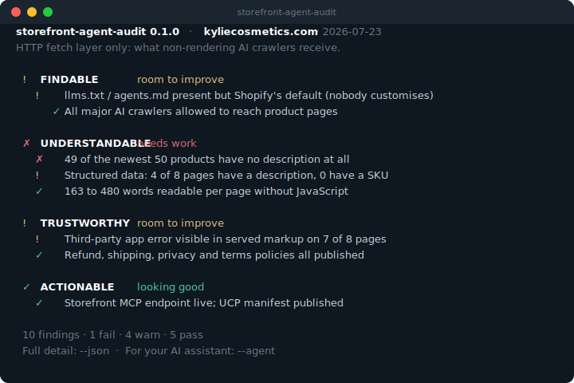

# storefront-agent-audit

**Audit what AI shopping agents can actually see on a Shopify storefront.** One command, no install, no signup.

Agent-first by design: you can run it yourself, or ask your AI assistant to run it and read the results back to you in plain English.

```bash
npx storefront-agent-audit yourstore.com
```



## Why this exists

Ask four AI assistants whether a product is in stock and you can get three different answers, delivered with equal confidence. That happens because each assistant improvises its own path to your store: crawling your pages, reading your feeds, rendering (or not rendering) your JavaScript, each one differently. The crawlers that feed most AI recommendations **do not run JavaScript** ([Vercel/MERJ measurement](https://vercel.com/blog/the-rise-of-the-ai-crawler)), so a store that looks immaculate in a browser can be nearly invisible to an agent, and stale or thin product data gets amplified into confidently wrong answers.

The one thing every path has in common is **your data**. Clean, complete, server-rendered product data produces consistent answers no matter which assistant reads it; gaps and staleness produce contradictions. That layer is what this tool audits, deterministically. Where the assistants improvise, the audit is a fixed reference: the same store gets the same reading, and every finding states exactly what was fetched and when.

This is also the direction the platforms themselves are heading. Shopify's agent-facing catalogue APIs and the Universal Commerce Protocol exist to replace improvised crawling with one structured, authoritative path to a store's products. The stores that win that transition are the ones whose data is ready for it. This tool checks whether yours is.

It is deliberately **not** a general SEO or performance auditor; it looks at one thing (agent-readiness) and tries to do it honestly.

## Run it with your AI assistant

The primary way to use this is through an agent. Tell your assistant:

> Run `npx storefront-agent-audit mystore.com --agent` and tell me what to fix first.

The `--agent` flag emits compact, findings-first markdown written to be read straight into an assistant's context, so you can keep the conversation going ("explain the structured-data one", "draft the fixes in order"). The repo ships a [`SKILL.md`](./SKILL.md) so assistants that support skills can install it, and an MCP server (`storefront-agent-audit-mcp`) for assistants that speak MCP.

## What it checks

Grouped by what each finding means for you:

- **Findable** – can agents reach and discover you: which market variant the audit read and whether your other markets are declared so agents can find them, `llms.txt` / `agents.md` (present, default, or customised, and if customised, whether it is any good), and robots.txt rules parsed *per AI crawler* against product paths (not just mentions).
- **Understandable** – can agents parse your products: description completeness across a sampled catalogue window, JavaScript-off content across several product pages, JSON-LD structured-data field completeness (handles `@graph` nesting).
- **Trustworthy** – will agents recommend you: published policy pages, errors visible in served markup.
- **Actionable** – can agents connect to transact: storefront MCP endpoint, UCP manifest, and a live **retrieval-quality test** that runs a structured budget query through your store's own agent-catalogue search and grades whether the results honour it. *(Connectivity and behaviour of the Shopify-native path; today's consumer assistants mostly still crawl instead, and the output says so.)*

Every finding ships with its own honesty caveat. The tool tells you what it cannot see.

## Scope and honesty

- Measures the **HTTP fetch layer** (relevant to non-rendering crawlers). Search-engine crawlers (Googlebot, Bingbot) and agentic browsers *do* render JavaScript; that is out of scope for this version and said so in the output.
- **Multi-market stores:** the report states which market variant it audited (locale and currency read from the served page) and how many others exist. Findings describe the audited market only; prices, stock and language differ elsewhere.
- Findings are a **point-in-time snapshot** of public endpoints. Nothing is written; no login required.
- Product sampling uses the newest published products, stated as such, not the whole catalogue.
- Shopify-first. Non-Shopify stores get the platform-neutral checks with a clear note.

## Options

```
--json           Full findings as JSON (lossless, for CI or scripts)
--agent          Compact markdown for an AI assistant
--check <id>     Run a single check
--sample <n>     Product pages to sample (default 8)
--no-color       Plain terminal output
```

Exit codes: `0` clean, `1` tool error, `2` findings present (for CI).

## Contributing

Issues and PRs welcome. See [CONTRIBUTING.md](./CONTRIBUTING.md). Built by [Alec Hewstone](https://github.com/ahwstn).

## Licence

MIT.
